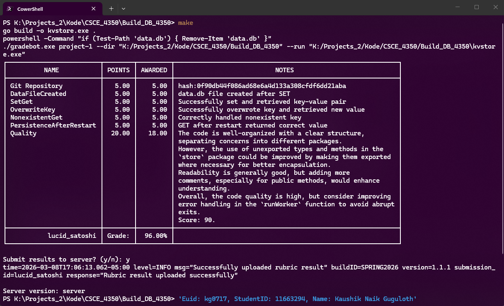

# Build_DB_4350
Build a database assignment repo for 4350 class

# Build and Grade

Run from base project folder
```
make
``` 

Or Run these commands from inside the 
`CSCE_4350\Build_DB_4350` project folder individually.

## 1. Build the Go program

```
go build -o kvstore.exe .
```

## 2. Delete the old database file if it exists

```
if (Test-Path "data.db") { Remove-Item "data.db" }
```

## 3. Run the grader

```
.\gradebot project-1 --dir "$PWD" --run "$PWD\kvstore.exe"
```


## Tested with gradebot v1.1.1


